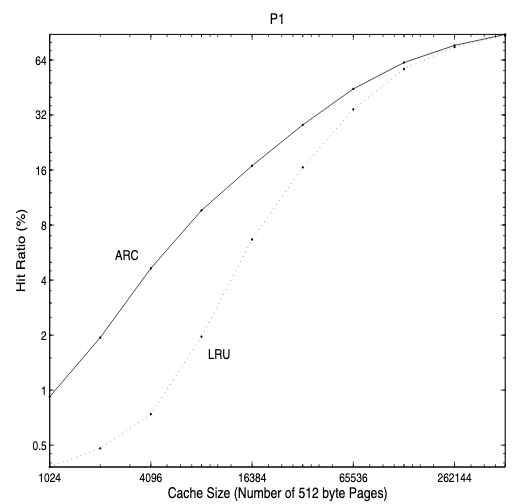

## Work-in-progress: Some content is subject to change before it is officially released on Friday, Feb 26.

## Important Dates and Other Stuff

**Due** Friday, 03/19, midnight (11:59 pm).

**This project is to be done by yourself.**

**This project will be graded on Zeus. So make sure your implementation compiles and works on Zeus.**

In this project, you'll implement and experiment with a series of
cache replacement policies (i.e., caching policies). Caching is one
of the oldest and most fundamental metaphor in modern computing. It
is widely used in storage systems (for example,
[OSes](https://www.linuxjournal.com/article/7105), [web
caches](https://memcached.org/), [distributed file
systems](https://docs.ceph.com/en/latest/rados/configuration/bluestore-config-ref/),
and a lot more). 
Any substantial progress in caching algorithms will affect the entire
modern computational stack.

There are three specific objectives to this project assignment:

* To gain hands-on experience implementing several widely-used cache
replacement policies.
* To get a deeper understanding about how different caching algorithms
may affect the performance of an application workload.
* To conduct entry-level, research-oriented, experimental analysis and
prepare a writeup that reports your approaches and your findings.


## GitLab Repo

Again, for this project, we supply you with a testing framework that
is written using bash script. The URL for the Git repository is located
at: [https://git.gmu.edu/cs571-proj-spring21/caching-policies](https://git.gmu.edu/cs571-proj-spring21/caching-policies).
As always, please **DO NOT** clone the Git repo directly. Instead,
follow the [GitLab Setup instructions](./gitlab_setup.html) to create
a **private** repo on the Mason GitLab server. You'll commit you
changes locally and push them to your private GitLab repo for
grading. 


## Overview: Basic Caching Model

In this project assignment, you will implement a series of cache
replacement policies, including three policies that are required to
implement: 
**LRU**, **MRU**, and **ARC**; 
(and two optional policies: **LFU** and Belady's **MIN** for extra credit.) 

We assume a **simulated** storage system that consists of two levels: a
*main memory* (or *cache*) and an *auxiliary storage*. The cache is
assumed to be much faster than the auxiliary storage, but is also
significantly more expensive. Hence, the size of the cache memory is
usually a fraction of the size of the auxiliary storage.  

Both the memory cache and the auxiliary storage are managed in units
of uniformly sized items known as *pages* (or *blocks* for auxiliary
storage). We assume a *demand paging* scenario, where a page of
memory is *paged in* the cache from the auxiliary storage only when a
request is made for the page and the page is not already present in
the cache. In particular, demand paging rules out
[prefetching](https://en.wikipedia.org/wiki/Cache_prefetching). For a
*full* cache, before a new page can be inserted into the cache, one
of the existing pages must be *paged out*. The victim page is
selected using a specified caching policy. Under demand paging model,
the caching policy is the only algorithm of interest. The most
important metric of success for a caching policy is its *hit rate* --
the fraction of pages that can be served from the main memory. The
*miss rate* is the fraction of pages that must be paged into the
cache from the auxiliary storage. 

The caching policies that you implement will simulate the behavior of
a real caching system. Since it is just simulation and what we care
about a caching policy's performance is simply its hit rate, you only
need to implement the caching policies in an **abstract** manner -- **to 
capture the number of cache hits (and the number of cache misses)**.
That is, you wouldn't care about implementing sophisticated
mechanisms that perform real data management (i.e., each storage
request is abstracted as a four-field vector) -- given a specific
storage trace file and a specific cache size, the simulator would
iterate through the provided trace file line-by-line and eventually
report the cache hit rate when the trace file is fully processed. 


## Program Specifications

### Basic Structure

You will implement the aforementioned caching policies in a simple
cache simulator skeleton framework that is provided by the
instructor. 

A cache simulation is driven by a program called `driver.c`, which
calls the caching functions declared in `cache.h` and defined in
`cache.c`. You will the `static` functions related to specific
caching policies in `cache.c`.

### Simulation Driver

The simulation driver (`driver.c`) takes several command-line
arguments as input: 

```c
static void usage(char *binname) {
    fprintf(stderr, "%s [-f trace_file] [-p caching_policy] [-s cache_size]\n", binname);
    fprintf(stderr, "\t-f <trace_file>: trace file\n");
    fprintf(stderr, "\t-p <caching_policy>: 0|1|2|3|4\n");
    fprintf(stderr, "\t\t0: LRU\n\t\t1: MRU\n\t\t2: ARC\n");
    fprintf(stderr, "\t\t3: LFU\n\t\t4: MIN\n");
    fprintf(stderr, "\t-s <cache_size>: cache capacity in num. pages\n");
    fprintf(stderr, "\t-h: show usage\n");
}
```

The driver can be invoked with three arguments; anything else is an
error and will call the above `usage()` function to print our the
following usage information:

```bash
% ./driver [-f trace_file] [-p caching_policy] [-s cache_size]
	-f <trace_file>: trace file
	-p <caching_policy>: 0|1|2|3|4
		0: LRU
		1: MRU
		2: ARC
		3: LFU
		4: MIN
	-s <cache_size>: cache capacity in bytes
	-h: show usage
``` 

Here is an example way to simulate an LRU policy with a trace file
`traces/P1.lis` and a cache that can hold up to 16384 pages (where
each page is of 512 KB):

```bash
% ./driver -f traces/P1.lis -p 0 -s 16384
```

`driver.c` already implements a function called `simulation_run()`,
which opens a specified `trace_file` and processes the `trace_file`
line-by-line using a `while` loop that calls `fscanf()`. For each
line read from the `trace_file`, the driver calls `cache_next_entry()`
that further calls a caching function defined in `cache.c` and specified
using the command-line argument `-p <caching_policy>`. 


### Trace Format

You are provided a list of storage trace datasets located in the
`traces/` directory. Use these traces to evaluate your caching
policies and conduct trace-driven analysis. 

Each line in a trace file contains a 4-field vector, corresponding to
a storage I/O request that touches one or multiple pages (blocks):

* **Field 1:** The logical block identifier (ID) -- the address of the data requested.

* **Field 2:** The number of pages (blocks) included in this request.

* **Field 3:** ~~This field is ignored.~~

* **Field 4:** The request ID -- the line number.

An I/O request may span multiple pages (specified using **Field 2**),
and thus will be broken into multiple requests each requesting an
individual page. See below the `for` loop (in function
`simulation_run()` of `driver.c`) that breaks a big multi-page
request into multiple page requests:

```c
  for (i = 0; i < req_size; i++) {
    // req_lba+i: logical block ID
    // caching_policy: encoded caching policy
    // cache_size: the cache capacity in number of pages (blocks)
    cache_next_entry(req_lba+i, caching_policy, cache_size);
  }
```


### Implement Caching Policies

The caching functions follow a naming convention of
`<policy>_next_entry()`, where the prefix `<policy>` specifies the
corresponding caching policy. These `<policy>_next_entry()` functions
left with `TODO`s are places where you will implement the specific
caching algorithms. 

You can add your own functions within `cache.c` if the implementation
of a particular `<policy>_next_entry()` function is too long. You can
also modify `cache.h` if needed. 

In this project, you should implement the following three caching policies:

* `LRU` (25% credit): When the user specifies `-p 0` when invoking the driver, 
the simulator should simulate the LRU policy. A common way to
approximate LRU is to use a mapping table (e.g., a hash table) for
keeping track of the cached pages and a linked list for tracking
recency.  When a new page item is inserted into the cache, this page
will be added to the mapping table and will be added to the MRU
position (either head or tail of the linked list depending on your
implementation of the data structure) of the linked list. When an
already-cached page item is referenced again, this page will be first
removed from the linked list and then added to the MRU position.
When the cache is full, the page item at the LRU position will be
evicted (i.e., removed from both the linked list and the mapping
table) before a new page can be inserted into the cache.

* `MRU` (25% credit): When the user specifies `-p 1` when invoking the driver, 
the simulator should simulate the MRU policy. MRU tracks recency and
works the opposite way as LRU does; that is, when the cache is full,
the page item at the MRU position will be evicted before a new page
can be inserted into the cache.

* `ARC` (30% credit): When the user specifies `-p 2` when invoking the driver,
the simulator should simulate the ARC policy. ARC will be built atop
your LRU mechanism (the mapping table and linked list data
structure). Follow the specifications (Fig. 4) in [the ARC
paper](https://www.usenix.org/legacy/events/fast03/tech/full_papers/megiddo/megiddo.pdf)
 to model ARC's behaviors. Specifically, your ARC policy should
handle the following cases:
	1. **Case I:** When page is already in the cache, move the accessed page 
to the MRU position of T2.
	2. **Case II-III:** When there is a miss and the missing page is in the ghost
cache (B1 or B2), follow the replacement and adaptation routine defined in 
the original algorithm<sup>[1](#myfootnote1)</sup>. 
	3. **Case IV:** When there is a miss and the missing page is not in the ghost cache: 
		1. **Case A:** L1 has exactly `capacity` (i.e., `c`) number of pages<sup>[1](#myfootnote1)</sup>.
		2. **Case B:** L1 has less than `capacity` (i.e., `c`) number of pages<sup>[1](#myfootnote1)</sup>.

* Project Report (20% credit): See [Prepare Project Report](#prepare-project-report).

`LFU` and `MIN` are optional:

* `LFU` (**15% extra credit**): When the user specified `-p 3` when invoking the driver,
the simulator should simulate the LFU policy. Since LFU tracks access
frequency instead of recency, you will need to implement a priority
queue<sup>[2](#myfootnote2)</sup> data structure to track frequency.
Priority queues, e.g., 
[binary heap](https://en.wikipedia.org/wiki/Binary_heap) or
[RB-tree](https://en.wikipedia.org/wiki/Red%E2%80%93black_tree),
could be used to achieve a time complexity of `O(logN)` when
inserting, deleting, and searching a page. However, you can always
use a linked list with a time complexity of `O(N)` -- it would be 
significantly slower when you run large trace dataset.

* `MIN` (**15% extra credit**): When the user specifies `-p 4` when invoking the driver,
the simulator should simulate the *offline* MIN policy. MIN assumes that
the cache has perfect future knowledge. To achieve this, MIN would
need multiple passes to a specified `trace_file`: 
	1. A first pass to annotate the original trace dataset with the
request ID of the immediate *next reference* (of the same page) -- this
pass will generate an annotated trace file. 
	2. A second pass to the annotated trace file -- the cache
simulation pass: in this pass, when making the eviction decision, the
cache would simply evict page with the largest *next reference*.
Again, you will implement a priority queue-like data structure that
sorts pages by the *next reference* field. The hit rate metric will
be calculated in this pass.
**Feel free to schedule a meeting to discuss your implementation plan
with the instructor if you are interesting in exploring MIN.**


### Report Caching Metrics

When you work on your first caching policy -- LRU, you may want to
implement the `report_cache_metrics()` function (defined in
`cache.c`) so that your simulator can generate a report of cache
performance statistics. For example, your code must report the **hit
rate** of the simulation run. In addition to the hit rate, you may
also want to report basic configuration options such as *caching
policy* and *cache capacity* as well as some other basic statistics
such as *number of operations*, *number of hits*, *number of misses*,
*time to finish the simulation run*. (For timing, you'll need to use a
timer (e.g., `gettimeofday()`).) 


### Miscellaneous Hints

When the driver invokes `<policy>_next_entry()` for the first time,
the cache structures must be initialized with an empty state.  For
example, to implement LRU, you can define your own `lru_cache`
struct, which has fields associated with a mapping table, a linked
list, and extra fields for recording runtime statistics.

Since you will be dealing with lots of pointer operations, make sure
to `free()` malloc'ed memory objects to avoid memory leakage. Run
`valgrind` at some point for this purpose. **We will not grade your
submission based on whether it leaks memory or not, as long as it can
finish a simulation run. However, a buggy implementation that
leaks memory may OOM (out-of-memory error) and crash, you never know.**

Keep versions of your code. More advanced programmers will use a
source control system such as git. Minimally, when you get a piece of
functionality working, make a copy of your .c file (perhaps a
subdirectory with a version number, such as v1, v2, etc.). By keeping
older, working versions around, you can comfortably work on adding
new functionality, safe in the knowledge you can always go back to an
older, working version if need be.

Alternatively, you can use Git's awesome feature the Git tags.  Git
is useful in tracking your development progress. You can use tags to
checkpoint the major milestones as you go. To do so, you can do
something like the following:

```bash
% git tag -a -m 'i finished LRU, LFU, and MRU, now working on ARC...' proj2-v1
% git push origin master proj2-v1
```

## Prepare Project Report

When you finish the implementation, you will measure the hit rates of 
all the provided traces in `traces/` by sizing the cache capacity. 
The configuration space is three-dimensional: 
1. various caching policies (LRU, MRU, and ARC, etc.),
2. various cache sizes,
3. various trace files (DS1, OLTP, P1-P7, and P12).

Pick 5-10 **meaningful** cache sizes (e.g., from 10,240-512,000)
and run all of your implemented caching policies. By meaningful, I mean
that the capacity is not too small (that effectively generates too
low of a hit rate) nor too big (that effectively yield the optimal
hit rate). The ARC paper uses a subset of the same traces for
simulation evaluation. Read Section V (Experimental Results) of [the
ARC
paper](https://www.usenix.org/legacy/events/fast03/tech/full_papers/megiddo/megiddo.pdf)
to get an idea. 

Note the ARC paper sizes the cache using a log-scale; you can,
however, linearly increase the cache size. The goal is to clearly
capture an increasing trend of the hit rate when the cache size
increases.  **Also note that your results might be slightly different
from what were reported in the ARC paper; this should be fine (as
the implementation details may vary).**

You will write a project report to describe your simulation results.
Your project report will address the following questions about your work:

* **Q1:** Your design and implementation. 
How did you implement the caching policies?

* **Q2:** Your experimental analysis. 
First, graph your results. making a graph that looks similar to the
one shown below. Use a good tool like `gnuplot`
([link](http://gnuplot.sourceforge.net/)) or `matplotlib`
([link](https://matplotlib.org/)). Visualization usually makes the
data much easier to digest; why do you think that is?
Then, explain your results.

<center>
  
</center>

* **Q3:** A discussion. 
What have you learned from this project assignment? You could discuss
anything ranging from debugging, implementation, to insights that you
drew while experimenting with your implemented caching policies. 

You may use Microsoft Word for the report. Or, if you like, you could
use [Latex](https://www.latex-project.org/), which is a high-quality typesetting system
for publication of scientific documents. 
If you choose to use MS Word, make sure to convert it to **pdf** for submission.
If you choose to use Latex, you can use the [USENIX latex
template](https://www.usenix.org/conferences/author-resources/paper-templates).


## What (and how) to hand in

You will submit your project assignment using GitLab. The submission
will consist of whatever is contained in your **private**
`caching-policies` repository, including the **source code** and **a pdf of
your project report**. 

1. You will need to share your **private** repository with our GTA
Michael (his GitLab ID is the same as his Mason Email ID:
`mcrawsha`).  Make sure to grant Michael a role of **"Developer"** or
**"Maintainer"**.  Note that "Guest" role permission does not
necessarily grant access.

2. Commit all your changes by typing:

	```bash
% git commit -am 'the final awesome solution of proj2: [Your Name] and [Your GMU ID]'
	```

And that's all. We will check the timestamp (your last commit
timestamp) for late submission. So make sure to submit before the
deadline.

**Have fun [caching](./public/images/caching_is_hard_paper.pdf)!**


## Footnotes

<a name="myfootnote1">1</a>: [ARC: A self-tuning, low overhead
replacement
cache](https://www.usenix.org/legacy/events/fast03/tech/full_papers/megiddo/megiddo.pdf).
Nimrod Megiddo, Dharmendra S. Modha. USENIX FAST 2003.


<a name="myfootnote2">2</a>: Unfortunately, there are not many
great, C-written, open-source data structure library that you can choose.
You may pretty much have to reinvent the wheel in C. However, since
this project is **open-ended**, you are welcome to search on your own
and find one (not too heavyweight) that suits your need. 


